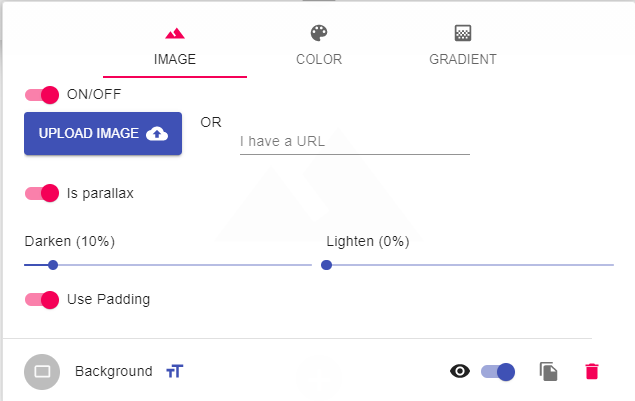

A few essential cell plugins are provided as part of react-page, as separate packages.

## Rich Text Editor

The RTE editor based on Slate is also a cell plugin. See [Rich Text Editing](/slate.md) for full details.

-----------------------------

## Spacer

The Spacer plugin allows one to create an arbitrary, controllable white space between rows or columns. The spacer can create both horizontal and vertical space, depending on whether it is inserted below a row or beside a column.

### Instantiation

Define the Spacer plugin as part of the cellPlugins list.

```
export const cellPlugins = [
  ... // Other cell plugins as usual
  spacer
];
```

### Installing

This plugin is a separate package: [@react-page/plugins-spacer](https://www.npmjs.com/package/@react-page/plugins-spacer)

-----------------------------

## Divider

The Divider plugin allows one to insert a horizontal line.

### Instantiation

Define the Divider plugin as part of the cellPlugins list.

```
export const cellPlugins = [
  ... // Other cell plugins as usual
  divider
];
```

### Installing

This plugin is a separate package: [@react-page/plugins-divider](https://www.npmjs.com/package/@react-page/plugins-divider)

-----------------------------

## Image

The Image plugin allows one to show an image in the content. The image source may be an existing link (eg from your existing server or storage etc), or uploaded to a destination of your choice (eg S3, backblaze etc).

The image can also be linked to any URL, and the URL may be set to "open in new window".

<p>
  <figure align="center">
    <br>
    <figcaption>Background controls and settings</figcaption>
  </figure>
</p>

### Instantiation

Define the Image plugin as part of the cellPlugins list, with its relevant settings.

```
export const cellPlugins = [
  ... // Other cell plugins as usual
  imagePlugin({
    imageUpload: uploadImage('https://upload.wikimedia.org/wikipedia/commons/a/a8/Derbys_Peter_Pan_peanut_butter_sample_blikje%2C_foto3.JPG')
  }),
];
```

The image upload handler is any function that receives a `File` and returns a `Promise<{url: string}>` with the uploaded image url. One can pass it a default image URL, in this example thats set as `https://upload.wikimedia.org/wikipedia/commons/a/a8/Derbys_Peter_Pan_peanut_butter_sample_blikje%2C_foto3.JPG`

### Upload handler

Here is an example of an image handler shim that will insert the default URL after 2 seconds. You can create the promise that will actually upload the image to some server and resolve with `{ url: someUploadedURL }`

```
function uploadImageShim(defaultUrl) {
  return function (file, reportProgress) {
    return new Promise(resolve => {
      setTimeout(() => {
        resolve({ url: defaultUrl });
      }, 2000);
    });

  };
};
```

### Installing

This plugin is a separate package: [@react-page/plugins-image](https://www.npmjs.com/package/@react-page/plugins-image)

-----------------------------

## Background control

The Background plugin is a "layout plugin", and allows one to control a section background by setting image and/or color. Note that other cell plugins can be placed on a background plugin.

<p>
  <figure align="center">
    <br>
    <figcaption>Background controls and settings</figcaption>
  </figure>
</p>

### Instantiation

Define the Background plugin as part of the cellPlugins list, with its relevant settings.

```
export const cellPlugins = [
  ... // Other cell plugins as usual
  background({
    imageUpload: uploadImage('/images/default.svg'),
    enabledModes:
      ModeEnum.COLOR_MODE_FLAG |
      ModeEnum.IMAGE_MODE_FLAG |
      ModeEnum.GRADIENT_MODE_FLAG,
  }),
];
````

The `enabledModes` setting controls the 3 tabs on the background plugin, enabling/disabling each in turn:

* IMAGE_MODE_FLAG - allows one to add an image as the background
* COLOR_MODE_FLAG - allows one to set the background color
* GRADIENT_MODE_FLAG - allows one to create gradients of multiple colors

### Installing

This plugin is a separate package: [@react-page/plugins-background](https://www.npmjs.com/package/@react-page/plugins-background)


