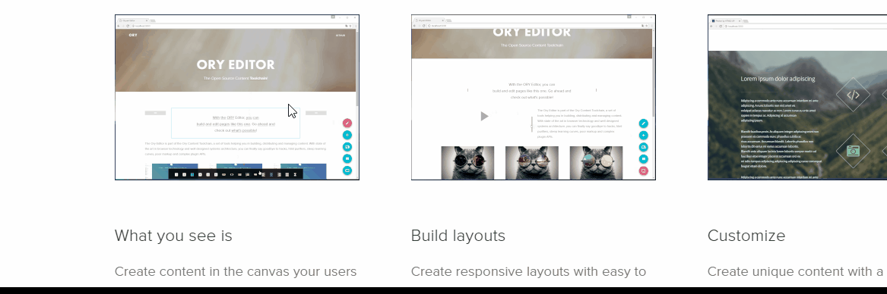

we provide some additional cell plugins that you can use right away:

### @react-page/plugins-image

[@react-page/plugins-image](https://www.npmjs.com/package/@react-page/plugins-image)

The image plugin allows you to add images to your content by entering their URL. The image plugin does not support
uploads.

  <figure align="center">
     
    <figcaption>The image plugin</figcaption>
  </figure>

The image plugin is not configurable.

[SimpleExample.tsx](https://raw.githubusercontent.com/react-page/react-page-examples/b8780b3fbbdc60f8337fea7cc0ec05b42da1a1f8/src/builtin-plugins/image.tsx ':include :type=code typescript')

### @react-page/plugins-video

[@react-page/plugins-video](https://www.npmjs.com/package/@react-page/plugins-video)

The image plugin allows you to add images to your content by entering their URL. The image plugin does not support
uploads.

  <figure align="center">
     
    <figcaption>The video plugin</figcaption>
  </figure>

### @react-page/plugins-spacer

[@react-page/plugins-spacer](https://www.npmjs.com/package/@react-page/plugins-spacer)

The spacer is a plugin which you can use to create an empty fixed height cell.

  <figure align="center">
     
    <figcaption>The spacer plugin</figcaption>
  </figure>

The spacer plugin is not configurable.

[spacer.tsx](https://raw.githubusercontent.com/react-page/react-page-examples/b8780b3fbbdc60f8337fea7cc0ec05b42da1a1f8/src/builtin-plugins/spacer.tsx ':include :type=code typescript')

### @react-page/plugins-background

[@react-page/plugins-background](https://www.npmjs.com/package/@react-page/plugins-background)

The background plugin is a layout plugin, allowing you to add a background image, gradients and parallax-backgrounds to your content.
