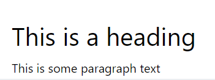

## Intro

The `<Editor />` component is the 1st component to be instantiated. It is used both for editing and displaying content (with `readOnly` set to true). At its simplest it needs a rich text editor - react-page comes preconfigured with Slate as a 'cellPlugin' to be used as the rich text editor. Optionally an image plugin can be added for uploading images or loading images from an existing source (URL).

```tsx
import Editor, { Value } from '@react-page/editor';
import '@react-page/editor/lib/index.css';

// The rich text area plugin (Slate)
import slate from '@react-page/plugins-slate';
import '@react-page/plugins-slate/lib/index.css';

// The image display plugin
import image from '@react-page/plugins-image';
import '@react-page/plugins-image/lib/index.css';

// Define which plugins we want to use.
const cellPlugins = [slate(), image];

export default function SimpleExample() {
  const [value, setValue] = useState<Value>(null);

  // ....

  // for editing
  <Editor cellPlugins={cellPlugins} value={value} onChange={setValue} />;

  // for displaying saved content
  <Editor cellPlugins={cellPlugins} value={value} readOnly />;

  // ....
};
```

### Editing
[Link to editing example](examples/pages/examples/simple.tsx)

[Live demo of the editing example](//demo/simple)

### Viewing
[Link to viewing example](examples/pages/examples/readonly.tsx)

[Live demo of the viewing example](//demo/readonly)

## Props

### `value: Value`

This is the content that the editor will display. The data for this prop may come from any source, eg a file or database or API etc. It is a JSON representation of the entire content that should be rendered. This information is "opaque", and is not meant to be edited directly under normal circumstances, so don't rely on its internal structure.

[More details](#internal-json-details)

### `onChange: (newValue: Value) => void`

A callback function whenever the editor has new data. This is not required when `readOnly` is `true`

### `readOnly: boolean`

If set to `true`, the content cannot be edited. Set this when using the editor to display the content. The code that is used for editing isn't loaded in this case, and hence there is a reduction in the bundle size if using webpack or similar bundlers.

If set to `false` during runtime, the editing UI is loaded and displays. This allows editing of the content.

This allows one to seamlessly switch between the display and editing modes.

E.g. you can have editing capabilities directly on the public facing page, where you normally just show the content. Simply check whether the current user is a publisher, display a button that will set `readOnly` to false and provide an `onChange` function to save the content.

### `cellPlugins: CellPlugin[]`

An array of `CellPlugin`s that can be used in this editor.

'react-page' comes with some inbuilt plugins and a superb extensible system to create new plugins for displaying anything.

Usually, the [`slate`](/slate.md) inbuilt plugin is perfectly suited for rich text editing. However, it can be replaced by a different editor plugin.

Refer to the following docs to see what is possible:

- [Inbuilt Cell Plugins](/builtin_plugins.md)
- [Custom Cell plugins](/custom-cell-plugins.md)

### `lang`

if the content to edit should be multi-language, you can pass a language id (e.g. `"en"`) here. Use together with `languages`

### `languages`

should be an array of `{lang: string, label: string}` and contain all languages that can be used:

```tsx
const LANGUAGES = [
  {
    lang: 'en',
    label: 'English',
  },
  {
    lang: 'de',
    label: 'Deutsch',
  },
];
```

That way an editing user can select the language at any time. Any cell will allways show the default language content unless another version in that language has been made. This is per cell so users can avoid the "copy everything to another language" problem that many CMS have! Users can just translate what needs to be translated.

Additionaly cells can be hidden _per language_.

### `cellSpacing`

Takes a number or an object `{x: number, y: number}:

```tsx
cellSpacing = {
  x: 15, // horizontal cell spacing
  y: 20, // vertical cell spacing
};
```

[Look at this example to see how cellSpacing affects the layout](//demo/examples/cellSpacing)

### `uiTranslator`

Takes a function `(label:string) => string`.  

This prop enables i18n support. All interface labels are wrapped with this function.

Below is the `uiTranslator` function provided in [the i18n demo](//demo/i18n).

```typescript
const TRANSLATIONS: { [key: string]: string } = {
  'Edit blocks': '编辑',
  'Add blocks': '添加',
  'Move blocks': '移动',
  'Resize blocks': '调整大小',
  'Preview blocks': '预览模式',
};

 const uiTranslator = useCallback((label?: string) => {
    if (TRANSLATIONS[label] !== undefined) {
      return TRANSLATIONS[label];
    }
    return `${label}(to translate)`;
  }, []);
```

### `childConstraints` (experimental)

Takes an object:

```
childConstraints: {
  maxChildren: number,
}
```

it will only show the (+) button to add new cells when it has less than `maxChildren` rows in the editor.

It currently just controls whether the button is shown, but its still possible to add new cells by dragging.
it will be revisited in the future and is therefore considered experimental.

## Internal JSON details

The entire page content is stored as an easy-to-parse JSON representation, consisting of the data (what the viewer sees) and the metadata (what is required to render the data eg ids, versions, plugin info, etc.)

This information is "opaque", and is not meant to be edited directly under normal circumstances, so don't rely on its internal structure.

It does not contain any presentation aspects of the data, ie no CSS is stored.

The JSON data is portable and can be copied into a new document to create a "clone" of the current doc for versioning or templating etc.

**Advantages**

Classic Rich Text Editors produce raw HTML-markup with both content data and content appearance bundled together. Whereas JSON representation is clean, much smaller in size and unopiniated. In other words, the same JSON representation can be used to present the data in different ways depending on the component used to render.

Some examples of the internal JSON representation for understanding:

### 1. Simple example

<p>
  <figure align="center">
    <br>
  </figure>
</p>

```json
{
  "id": "obknih",
  "version": 1,
  "rows": [
    {
      "id": "b27eia",
      "cells": [
        {
          "id": "e9htzt",
          "size": 12,
          "plugin": {
            "id": "ory/editor/core/content/slate",
            "version": 1
          },
          "dataI18n": {
            "default": {
              "slate": [
                {
                  "type": "HEADINGS/HEADING-TWO",
                  "children": [
                    {
                      "text": "This is a heading"
                    }
                  ]
                },
                {
                  "type": "PARAGRAPH/PARAGRAPH",
                  "children": [
                    {
                      "text": "This is some paragraph text"
                    }
                  ]
                }
              ]
            }
          },
          "rows": [],
          "inline": null
        }
      ]
    }
  ]
}
```

### 2. Simple example with image

<p>
  <figure align="center">
    <br>
  </figure>
</p>

```json
{
  "id": "obknih",
  "version": 1,
  "rows": [
    {
      "id": "b27eia",
      "cells": [
        {
          "id": "e9htzt",
          "size": 12,
          "plugin": {
            "id": "ory/editor/core/content/slate",
            "version": 1
          },
          "dataI18n": {
            "default": {
              "slate": [
                {
                  "type": "HEADINGS/HEADING-TWO",
                  "children": [
                    {
                      "text": "This is a heading"
                    }
                  ]
                },
                {
                  "type": "PARAGRAPH/PARAGRAPH",
                  "children": [
                    {
                      "text": "This is some paragraph text"
                    }
                  ]
                }
              ]
            }
          },
          "rows": [],
          "inline": null
        }
      ]
    },
    {
      "id": "5j8lyl",
      "cells": [
        {
          "id": "k0t2gk",
          "size": 12,
          "plugin": {
            "id": "ory/editor/core/content/image",
            "version": 1
          },
          "dataI18n": {
            "default": {
              "src": "https://www.nasa.gov/sites/default/files/styles/full_width/public/thumbnails/image/mars2020-sample-tubes.jpg?itok=SiZDKmmG"
            }
          },
          "rows": [],
          "inline": null
        }
      ]
    }
  ]
}
```

### Custom Editor UI: `components` (experimental)

if you need more control of the Editor UI, you can override some internal Components.
Use this always as a last resort as you might not get the full functionality of ReactPage.
Please always file an Issue first about what you exactly want to get customized or change
as there might be another, easier solution that will result in a new Feature for ReactPage.
This way we can share innovations!

Currently you can replace these Components:

- BottomToolbar: The Component that renders the Toolbar on the bottom that reveals the plugin controls and some cell actions

(please file also an issue or Pull Request if you want to add more components to replace)
