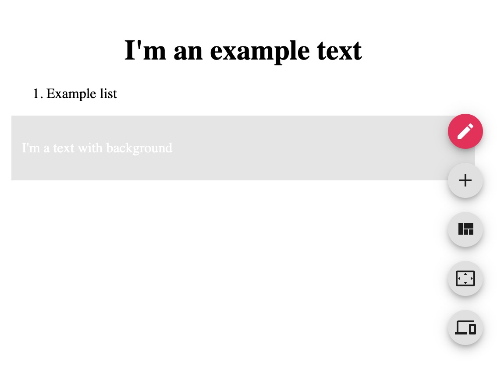

## Installation

To install the editor, use:

```bash
$ yarn add @react-page/editor
$ npm i --save @react-page/editor
```

## Simple example

[To get off the ground as soon as possible, simply create a component like so](https://github.com/react-page/react-page-examples/blob/master/src/SimpleExample.tsx):

[SimpleExample.tsx](https://raw.githubusercontent.com/react-page/react-page-examples/master/src/SimpleExample.tsx ':include :type=code typescript')

That's it, congratulations! You should see something like this now:



## Readonly

Simply provide a `readOnly={true}` prop to your editor from previous example.  
We will lazy load the unnecessary UI if you use this approach (using code splitting).

This can greatly decrease the size of this lib. Make sure to use this option if you don't require the editing capabilities of the editor and care about your app size (which you should!)

[SimpleReadonly.tsx](https://github.com/react-page/react-page-examples/blob/master/src/SimpleReadonly.tsx)

[SimpleReadonly.tsx](https://raw.githubusercontent.com/react-page/react-page-examples/master/src/SimpleReadonly.tsx ':include :type=code typescript')
