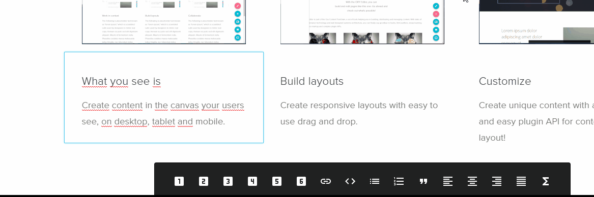

## Slate as the RTE

An advanced rich text editor (RTE) based on [slate](http://slatejs.org) is used as a `CellPlugin`.

It has to be installed separately:

```bash
$ yarn add @react-page/plugins-slate
# OR
$ npm i --save @react-page/plugins-slate
```

You additionally need to import the css file:

```typescript
import '@react-page/plugins-slate/lib/index.css';
```

<p>
  <figure align="center">
    <br>
    <figcaption>The text editing plugin based on <a href="http://slatejs.org">Slate</a></figcaption>
  </figure>
</p>

## Usage

See [Editor component](/editor.md) for basic usage.

The **slate CellPlugin** itself is highly customizable and has its own plugin sytem!

The inbuilt Slate plugins can be selectively enabled / disabled, or extended to control how any paragraph, headline or other markup is rendered. Further, one can add custom plugins as required.

## Inbuilt Slate plugins

- `paragraph`: default paragraph
- `headings`: headings h1 - h6
- `emphasize`: em, strong and underline
- `alignment`: allows to align left, right center and justify,
- `lists`: ordered and unordered lists
- `blockquote`: blockquote
- `code`: code
- `link`: links

## Customizing the Slate plugin

### Example 1: Selectively enable some slate inbuilt plugins

To customize the **slate CellPlugin**, call it with a function that changes its default configuration.

In this example, only some of the inbuilt Slate plugins are being enabled:

```tsx
import Editor from '@react-page/editor';
import slate from '@react-page/plugins-slate';
import '@react-page/plugins-slate/lib/index.css';

const myCustomSlatePlugin = slate(def => ({
  ...def, // this is the default configuration
  id: "my-custom-slate-plugin" // Each slate plugin should get its own ID
  title: "custom slate plugin",
  description: "it only provides title and text"
  // Selectively enable some slate inbuilt plugins
  plugins: {
    headings: def.plugins.headings,
    emphasize: def.plugins.emphasize,
    paragraphs: def.plugins.paragraphs /* make sure to always include that */
  }
  // other overrides
})
```

Instead of passing slate() to the editor

```
const cellPlugins = [slate(), image];
```

one can now do:

```
const cellPlugins = [myCustomSlatePlugin(), image];
```

Note: the default export of `@react-page/plugins-slate` is a function that returns a `CellPlugin`. When called without any argument, it will use the default configuration. if you pass a callback function, it will use the configuration you return from that function. This callback function will receive the default configuration. This way you can return the default configuration and alter it as in the example above (using object spread).

### Example 2: Customize the inbuilt slate plugins

The inbuilt slate plugins can be individually customized by providing a customize function. It will take the plugin's default config and return a new config. Most obvious usecase is to change the component that renders the plugin's content:

```tsx
// any custom component
const RedH1 = ({ style, ...props }: Props) => (
  <h1 style={{ ...style, color: 'red' }} {...props} />
);

const slatePlugin = slate(slateDef => ({
  ...slateDef,
  plugins: {
    emphasize: slateDef.plugins.emphasize,
    headings: {
      // we can customize the h1 by providing a transform function
      h1: slateDef.plugins.headings.h1(h1Def => ({
      ...h1Def, // spread it, so that the new config contains all defaults
      Component: ({style, children}) => (
        <RedH1 style={style}>{children}</RedH1>
      )
    }))
    }
  }
})
```

If you use typescript (and you should!), you will get nice typechecking in the customize function.

## Custom slate plugins

Enhancing the inbuilt slate plugins may not be enough in some cases. Eg:

1. Say one wants to create internal links, where the pages are stored in a database. Instead of asking for the full url, the user will see a select field of all pages. When the user makes a selection, ReactPage will only store the id of that page. That way the links will still be valid when the page is moved or renamed.
2. Say one wants to create a landing page for an eCommerce project with links to products from the shop.

### Adding a custom plugin

Add a custom plugin as follows:

```tsx
import slate from '@react-page/plugins-slate';

const slatePlugin = slate(def => ({
  ...def,
  plugins: {
    ...def.plugins.
    yourCustomNamespace: {
      myCustomPlugin: myCustomPlugin()
    }
  }
})
```

Notice: `yourCustomNamespace` and `myCustomPlugin` can be named arbitrary. Typescript users will find the existing type definition on def.plugins usefull to see which plugins do exist.

### Create a custom plugin

Use the factory functions:

- `createComponentPlugin`: allows to create a plugin which has a component (most built-in plugins use this factory).
- `createSimpleHtmlBlockPlugin`: a more convenient variant of `createComponentPlugin`. It renders a simple component with a html-tag and has built-in serialization. used by plugins like `headings` or `blockquote`
- `createMarkPlugin`: similar to `createSimpleHtmlBlockPlugin` but renders a "mark" with a hover button on selection
- `createDataPlugin`: this plugin toggles data on the current block or inline element, but does not render a component. E.g. the alignment-plugin uses this factory
  you can import these with:

```tsx
import { pluginFactories } from '@react-page/plugins-slate';
```

### component plugins

The most common plugin type is a component plugin.

As an example take a look at this plugin which colors the selected text:

[customSlatePlugin.tsx](examples/plugins/customSlatePlugin.tsx ':include :type=code typescript')

#### void plugins

A void plugin does not wrap text but is just an element. This could be an image or something like a form field.

See this example of a form field plugin

[formFieldInText.tsx](examples/pages/examples/formFieldInText.tsx ':include :type=code typescript')

## Slate plugins with custom data

Some plugins require custom data that the user has to provide. E.g. the `link` plugin needs a `href: string`. Easiest way is to define a jsonSchema for the slate plugin. This will auto-generate a form that can update the plugin.

See the built in link plugin as an example:

[link.tsx](examples/slate-plugin-src/plugins/links/link.tsx ':include :type=code typescript')

#### For **typescript**-users

As you can see, all factories take a generic type Argument. E.g.

```tsx
type LinkData = {
  href: string;
  openInNewWindow?: boolean;
};


const yourLinkPlugin = createComponentPlugin<LinkData>({
  ...
})
```

this ensures that whenver data is used, the type is correct. Very handy also for consumers of your plugin:

```tsx
const linkWithMyOverrriddenComponent = yourLinkPlugin((def) => ({
  ...def,
  Component: ({ data, children }) => (
    <SuperFancyLink
      href={data.href /* neat! autocompletion and type checking here! */}
    >
      {children}
    </SuperFancyLink>
  ),
}));
```

the consumer could even change the add more properties to the data type, altough its up to them to adjust the controls and serialization so that the new DataType is satisfied:

```tsx
const linkWithTracking = yourLinkPlugin<{ campaignTrackingId?: string }>(
  (def) => ({
    ...def,
    Component: ({ href, campaignTrackingId, children }) => (
      <LinkWithTracking href={href} campaignTrackingId={campaignTrackingId}>
        {children}
      </LinkWithTracking>
    ),
    controls:
      def.controls.type === 'autoform'
        ? {
            ...def.controls,
            schema: {
              // this now needs to be compatible to your new data.
              // its best to spread in the default schema (if `yourLinkPlugin` already defines one)
              // and extend it.
              // typescript will help you with that
              ...def.controls.schema,
              properties: {
                ...def.schema.properties,
                campaignTrackingId: {
                  title: 'Campaign Tracking ID',
                  type: 'string',
                },
              },
            },
          }
        : null,

    // deserialize needs to be update, because `campaignTrackingId` is not defined as optional above
    deserialize: {
      // we spread in all defaults, but update getData to also include `campaignTrackingId`
      ...def.deserialize,
      getData: (el) => ({
        ...def.serialization.getData(el),
        campaignTrackingId: 'some-default-id',
      }),
    },
  })
);
```

## Prefilled layouts

This allow one to restrict slate to certain layout plugins. E.g. you have a info-box where you only want to allow: h3, bold, emphasize and underline:

```tsx
// this is the default slate configuration with all plugins
const defaultSlate = slate();

// this will be our restricted slate
const infoboxSlate = slate(def => ({
  ...def,
  id: def.id + '/infobox', // give it some  name, it has to be unique
  hideInMenu: true, // We don't want to show it in the menu, we need it only for layout-plugins
  plugins: {
    headings: {
      h3: def.plugins.headings.h3,
    },
    paragraphs: def.plugins.paragraphs,
    emphasize: def.plugins.emphasize,
  },
}));


const infobox: CellPlugin = {
  id: 'infobox',
  title: 'Infobox',
  description: 'Some infobox',
  version: 1,
  Renderer: ({ children, state }: any) => (
    <div
      style={{
        border: '1px solid black',
        borderRadius: 4,
        padding: 20
      }}
    >
      {children}
    </div>
  ),
  createInitialChildren: () => {
    return [
      [
        {
          plugin: infoboxSlate
          data: infoboxSlate.createData(({ plugins }) => ({
            children: [
              {
                plugin: plugins.headings.h3,
                children: ['Hello world'],
              },
              {
                plugin: plugins.paragraphs.paragraph,
                children: ['Title and paragraph'],
              },
            ],
          })),
        },
      ],
    ];
  },

}


// dont forget to add this custom plugin to your plugins:

 <Editor
  cellPlugins={[
      defaultSlate,
      infoboxSlate,
      infobox,
  ]}
 onChange={save} />
```

### Examples

#### Example: Simple color plugin

[customSlatePlugin.tsx](examples/plugins/customSlatePlugin.tsx ':include :type=code typescript')

#### Example: Katex plugin

[katexSlatePlugin.tsx](examples/plugins/katexSlatePlugin.tsx ':include :type=code typescript')
